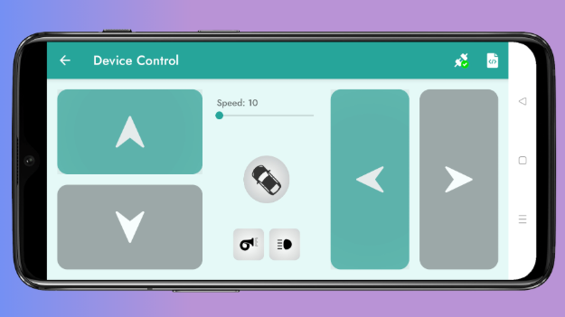

# Bluetooth Kontrollü 4WD Arazi Aracı

## 1. Projenin Amacı

Arduino Uno kartı, çift L298N motor sürücü modülü ve HC-06 Bluetooth modülü kullanılarak, mobil uygulama üzerinden bluetooth bağlantısıyla kontrol edilebilen, dört tekerlekten çekişli ve direksiyon mekanizmalı bir robotik araç.

## 2. Kullanılan Malzemeler

- **Arduino Uno**
- **2 adet L298N Motor Sürücü Kartı**
- **HC-06 Bluetooth Modülü**
- **7.4V 800mAh Li-Po Batarya**
- **4 adet DC Motor ve Arazi Şasisi**
- **Jumper kablolar**

## 3. Donanım ve Bağlantı Şeması

### 3.1. Güç Dağıtımı

- **Batarya (+):** Birinci L298N'in 12V girişine bağlandı. İkinci L298N'in 12V girişi birinci sürücüden paralel hat çekildi.
- **Batarya (-):** Birinci L298N'in GND girişine bağlandı. Arduino ve ikinci sürücü GND uçları burada birleştirilerek **ortak toprak** sağlandı.
- **Arduino Beslemesi:** L298N üzerindeki 5V çıkış pini, Arduino'nun 5V pinine bağlanarak sistem tek batarya ile çalışır hale getirildi.

### 3.2. Motor Sürücü ve Arduino Bağlantıları

Projede kullanılan özel bağlantı yapısı:

| Bileşen | Fonksiyon | Arduino Pini |
|---|---|---|
| Sürücü 1 - ENA | Ön Motor Hız (PWM) | 9 |
| Sürücü 1 - IN1/IN3 | Ön Motor Yön Kontrol | 10 / 6 |
| Sürücü 1 - ENB | Arka Motor Hız (PWM) | 5 |
| Sürücü 1 - IN2/IN4 | Arka Motor Yön Kontrol | 11 / 7 |
| Sürücü 2 - ENA2 | Sağ-Sol Motor Hız (PWM) | 12 |
| Sürücü 2 - IN1_2/IN2_2 | Sağ-Sol Yön Kontrol | 4 / 8 |

### 3.3. Bluetooth Modülü Bağlantıları

- **VCC:** Arduino 5V
- **GND:** Arduino GND
- **TX:** Arduino Dijital Pin 2 (RX)
- **RX:** Arduino Dijital Pin 3 (TX)

## 4. Yazılım

`SoftwareSerial.h` kütüphanesini kullanarak Bluetooth üzerinden gelen karakter verilerini işler.

- **Veri İşleme:** Mobil uygulamadan gelen `Front ("İleri")`, `Back ("Geri")`, `Left ("Sol")`, `Right ("Sağ")` ve `Stop ("Dur")` karakterleri bir if-else yapısı ile okunur.
- **Güvenlik:** `Stop ("Dur")` komutu geldiğinde tüm motor sürücü pinleri LOW konumuna getirilerek aracın anında durması sağlanır.

## 5. Uygulama ve Test

1. **Haberleşme Testi:** HC-06 modülü telefon ile eşleştirilmiş ve veri akışı seri port monitöründen doğrulanmıştır.
2. **Hareket Testi:** Aracın ileri, geri, sağa kırma ve sola kırma fonksiyonlarının karakter komutlarına tepki süresi ve doğruluğu test edilmiştir.
3. **Güç Testi:** 7.4V bataryanın hem motorları hem de Arduino'yu yük altında stabil şekilde beslediği gözlemlenmiştir.

## 6. Sonuç

Çift L298N kullanımı sayesinde aracın hem çekiş sistemi (ön/arka motorlar) hem de manevra sistemi (sağ/sol motoru) birbirinden bağımsız ve güçlü bir şekilde kontrol edilebilmektedir.

## Kontrol Uygulaması

Kontrol edebilmek için kullanılan uygulama: **Arduino Bluetooth Controller**

Link: https://play.google.com/store/apps/details?id=com.giristudio.hc05.bluetooth.arduino.control&pcampaignid=web_share

## Hazırlayanlar

1. **Yiğit Can Yılmaz**
2. **Eda Tuğba Gülci**
3. **Mihriban Janmuradova**
